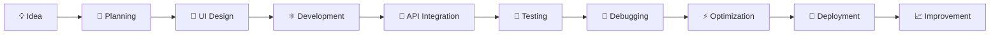

# 👩‍💻 MALIHA ARSHAD

<div align="center">


<br>

<a href="https://github.com/maliha12">

</a>


<br><br>


</div>

---

# 🌟 ZYNXIS FRONTEND DEVELOPMENT INTERNSHIP

Welcome to the official repository of **Maliha Arshad's Zynxis Frontend Development Internship**.

This repository contains the complete **8-week frontend development journey**, including weekly tasks, practical implementations, reusable components, interactive applications, API integration, state management, performance optimization, and the final dashboard project.

The internship focused on transforming frontend development concepts into practical, real-world applications using modern web technologies.

> 💡 **Learn → Build → Test → Optimize → Deploy**

---

# 👩‍💻 DEVELOPER PROFILE

<div align="center">

| 👤 Profile         | 💼 Professional Information            |
| ------------------ | -------------------------------------- |
| **Name**           | Maliha Arshad                          |
| **GitHub**         | `maliha12`                             |
| **Role**           | Frontend Developer                     |
| **Internship**     | Zynxis Frontend Development Internship |
| **Duration**       | 8 Weeks                                |
| **Specialization** | Frontend Web Development               |
| **Focus**          | UI/UX • React • Responsive Design      |
| **Repository**     | Zynxis Internship                      |
| **Status**         | 🟢 Completed                           |

</div>

---

# 🚀 ABOUT ME

I am a passionate **Frontend Developer** focused on creating modern, responsive, interactive and user-friendly web applications.

My development approach combines:

```text
🎨 Beautiful UI
       +
📱 Responsive Design
       +
⚛️ Component Architecture
       +
🔌 API Integration
       +
📦 State Management
       +
⚡ Performance
       =
🚀 Modern Web Experience
```

I enjoy turning ideas and designs into functional digital experiences while continuously improving my development skills.

---

# 🧠 FRONTEND DEVELOPER MINDSET

```javascript
const maliha = {
    name: "Maliha Arshad",
    username: "maliha12",
    role: "Frontend Developer",

    focus: [
        "Responsive Web Development",
        "Modern UI/UX",
        "React Applications",
        "Reusable Components",
        "API Integration",
        "State Management",
        "Performance Optimization"
    ],

    principles: [
        "Clean Code",
        "Reusable Architecture",
        "Responsive Design",
        "User Experience",
        "Performance First",
        "Continuous Learning"
    ],

    currentStatus: "🚀 Building & Learning"
};
```

---

# 🛠️ TECHNOLOGY STACK

## 🌐 Core Web Technologies

<div align="center">


</div>

* HTML5
* CSS3
* JavaScript
* TypeScript
* Semantic HTML
* Responsive CSS
* Modern JavaScript

---

## ⚛️ Frontend Development

<div align="center">


</div>

* React
* React Hooks
* Component Architecture
* Props & State
* Reusable Components
* Vite
* Modern Frontend Architecture

---

## 🎨 UI / UX & Styling

<div align="center">


</div>

* Tailwind CSS
* Responsive Design
* Mobile-first Development
* UI Components
* Animations
* Transitions
* Modern Layouts
* User Experience

---

## 🔌 APIs & Data

* REST APIs
* Fetch API
* JSON
* Async/Await
* API Error Handling
* Loading States
* Dynamic Data Rendering

---

## 🔧 Development Tools

<div align="center">


</div>

* Git
* GitHub
* VS Code
* npm
* Browser DevTools
* Debugging Tools

---

# 📚 8-WEEK INTERNSHIP JOURNEY

<div align="center">

| Week | Development Area           |    Status    |
| :--: | -------------------------- | :----------: |
|  01  | 📱 Responsive Layouts      |  ✅ Completed |
|  02  | 🧩 Component Library       |  ✅ Completed |
|  03  | ⚡ Dynamic Interactions     |  ✅ Completed |
|  04  | 🎨 Styling & Animations    |  ✅ Completed |
|  05  | 🔌 API Integration         |  ✅ Completed |
|  06  | 📦 State Management        |  ✅ Completed |
|  07  | ⚡ Performance Optimization |  ✅ Completed |
|  08  | 📊 Final Dashboard Project | 🏆 Completed |

</div>

---

# 📱 WEEK 01 — RESPONSIVE LAYOUTS

### 🎯 Focus

Building responsive web interfaces that work across different screen sizes.

### 🔨 Skills Practiced

* 📱 Mobile-first design
* 💻 Desktop layouts
* 📐 Flexbox
* 🔲 CSS Grid
* 🧭 Responsive navigation
* 📲 Media queries
* 🖥️ Cross-device compatibility

### ✅ Status

**COMPLETED**

---

# 🧩 WEEK 02 — COMPONENT LIBRARY

### 🎯 Focus

Creating reusable and maintainable frontend components.

### 🔨 Skills Practiced

* Reusable components
* UI component architecture
* Buttons
* Cards
* Forms
* Navigation
* Component composition
* Consistent styling

### ✅ Status

**COMPLETED**

---

# ⚡ WEEK 03 — DYNAMIC INTERACTIONS

### 🎯 Focus

Creating interactive and dynamic frontend applications.

### 🔨 Skills Practiced

* React Hooks
* Event handling
* Dynamic rendering
* User interactions
* State-based UI
* Interactive product interfaces
* Conditional rendering

### ✅ Status

**COMPLETED**

---

# 🎨 WEEK 04 — STYLING & ANIMATIONS

### 🎯 Focus

Creating modern, attractive and interactive user interfaces.

### 🔨 Skills Practiced

* Advanced CSS
* Tailwind CSS
* Animations
* Transitions
* Hover effects
* Interactive UI
* Responsive styling
* Visual hierarchy

### ✨ Goal

Build interfaces that feel modern, smooth and engaging.

### ✅ Status

**COMPLETED**

---

# 🔌 WEEK 05 — API INTEGRATION

### 🎯 Focus

Connecting frontend applications with external APIs.

### 🔨 Skills Practiced

* REST APIs
* Fetch API
* JSON data
* Async/Await
* Loading states
* Error handling
* Dynamic data
* API-driven UI

### 🔄 Development Flow

```text
Frontend
   ↓
API Request
   ↓
Server
   ↓
JSON Response
   ↓
Data Processing
   ↓
UI Rendering
```

### ✅ Status

**COMPLETED**

---

# 📦 WEEK 06 — STATE MANAGEMENT

### 🎯 Focus

Managing application state and data flow efficiently.

### 🔨 Skills Practiced

* Application state
* Component state
* State synchronization
* Data flow
* Persistent state
* Component communication
* State-based rendering

### ✅ Status

**COMPLETED**

---

# ⚡ WEEK 07 — PERFORMANCE OPTIMIZATION

### 🎯 Focus

Making frontend applications faster and more efficient.

### 🔨 Optimization Techniques

* 🖼️ Image optimization
* 💤 Lazy loading
* 📦 Component optimization
* ⚡ Faster rendering
* 🧹 Code optimization
* 📱 Mobile optimization
* 🔍 Lighthouse auditing
* 📊 Performance analysis

### 🏆 Performance Goal

```text
Lighthouse Performance
        ↓
      90+
        ↓
⚡ Fast • Responsive • Optimized
```

### ✅ Status

**COMPLETED**

---

# 🏆 WEEK 08 — FINAL PROJECT

# 🚀 ZYNXIS CLIENT DASHBOARD

The final internship project brings together the knowledge and skills developed throughout the previous seven weeks.

The project is a modern **SaaS-style client management dashboard** designed with a professional frontend architecture and responsive user experience.

---

## ✨ FINAL PROJECT FEATURES

### 📊 Dashboard

* Dashboard overview
* Statistics
* Data visualization
* Activity information
* Professional layout

### 👥 Client Management

* ➕ Add clients
* 👁️ View clients
* ✏️ Edit clients
* 🗑️ Delete clients
* 🔍 Search clients
* 🎯 Filter clients

### 🎨 UI / UX

* 🌙 Dark mode
* ☀️ Light mode
* 📱 Fully responsive
* ✨ Smooth animations
* 🧩 Reusable components
* 🔔 Notifications
* 🎨 Modern interface

### 📦 Data Management

* Persistent state
* CRUD functionality
* Form handling
* Validation
* Dynamic updates

### ⚡ Performance

* Optimized components
* Responsive layouts
* Efficient rendering
* Performance-focused architecture

### 🏆 Status

**FINAL PROJECT COMPLETED**

---

# 📂 REPOSITORY STRUCTURE

```text
Zynxis-internship-Maliha-Arshad-
│
├── 📁 Week1_Responsive_layouts
│   └── Responsive Layout Project
│
├── 📁 Week2_Component_library
│   └── Component Library Project
│
├── 📁 Week3_Dynamic_Interactions
│   └── Dynamic Interaction Project
│
├── 📁 Week4_Styling_Animations
│   └── Styling & Animation Project
│
├── 📁 Week5_API_Integration
│   └── API Integration Project
│
├── 📁 Week6_State_Management
│   └── State Management Project
│
├── 📁 Week7_Performance_Optimization
│   └── Performance Optimization Project
│
├── 📁 Week8_final_Dashboard_Project
│   └── 🚀 Final Zynxis Dashboard
│
└── 📄 README.md
```

---

# 💼 FRONTEND DEVELOPMENT SKILLS

<div align="center">

| Skill                    | Level |
| ------------------------ | ----- |
| HTML5                    | ⭐⭐⭐⭐⭐ |
| CSS3                     | ⭐⭐⭐⭐⭐ |
| JavaScript               | ⭐⭐⭐⭐⭐ |
| TypeScript               | ⭐⭐⭐⭐  |
| React                    | ⭐⭐⭐⭐⭐ |
| Responsive Design        | ⭐⭐⭐⭐⭐ |
| UI/UX                    | ⭐⭐⭐⭐⭐ |
| API Integration          | ⭐⭐⭐⭐  |
| State Management         | ⭐⭐⭐⭐  |
| Git & GitHub             | ⭐⭐⭐⭐⭐ |
| Performance Optimization | ⭐⭐⭐⭐  |

</div>

---

# 🧹 DEVELOPMENT PRINCIPLES

### 01 — Clean Code

Writing readable, maintainable and structured code.

### 02 — Reusable Components

Building components that can be reused throughout applications.

### 03 — Responsive First

Ensuring applications work across:

```text
📱 Mobile
📲 Tablet
💻 Laptop
🖥️ Desktop
🖥️ Large Displays
```

### 04 — Performance First

Building fast and optimized experiences.

### 05 — User Experience

Creating simple, intuitive and accessible interfaces.

### 06 — Continuous Learning

Always improving skills through practical development.

---

# 🔄 DEVELOPMENT WORKFLOW



---

# 🧠 WHAT THIS INTERNSHIP DEVELOPED

Through this 8-week journey, practical experience was gained in:

```text
⚛️ React Development
        ↓
🧩 Component Architecture
        ↓
📱 Responsive Design
        ↓
🎨 UI/UX Development
        ↓
⚡ Dynamic Interactions
        ↓
🔌 API Integration
        ↓
📦 State Management
        ↓
✨ Animations
        ↓
⚡ Performance Optimization
        ↓
🔧 Git & GitHub
        ↓
🚀 Production-Oriented Development
```

---

# 📊 GITHUB STATISTICS

<div align="center">


<br><br>


<br><br>


</div>

---

# 🐍 CONTRIBUTION GRAPH

<div align="center">


</div>

---

# 📈 DEVELOPMENT PROGRESS

```text
START
  │
  ▼
📱 Responsive Layouts
  │
  ▼
🧩 Component Development
  │
  ▼
⚡ Dynamic Interactions
  │
  ▼
🎨 Styling & Animations
  │
  ▼
🔌 API Integration
  │
  ▼
📦 State Management
  │
  ▼
⚡ Performance Optimization
  │
  ▼
🏆 FINAL DASHBOARD
  │
  ▼
🚀 FRONTEND DEVELOPER
```

---

# 🎯 PROFESSIONAL OBJECTIVE

> **"To continuously develop modern frontend solutions that combine clean code, beautiful interfaces, responsive layouts, strong performance and excellent user experience."**

---

# 🌟 CURRENT STATUS

<div align="center">

### 👩‍💻 MALIHA ARSHAD


<br><br>

| 🎯 Internship Progress | 🏆 Result    |
| ---------------------- | ------------ |
| Week 1                 | ✅ Completed  |
| Week 2                 | ✅ Completed  |
| Week 3                 | ✅ Completed  |
| Week 4                 | ✅ Completed  |
| Week 5                 | ✅ Completed  |
| Week 6                 | ✅ Completed  |
| Week 7                 | ✅ Completed  |
| Week 8                 | 🏆 Completed |

</div>

---

# 💙 THANK YOU — ZYNXIS

Special thanks to **Zynxis** for providing the opportunity to learn, build, practice and improve frontend development skills through an intensive 8-week internship journey.

This repository represents the progression from learning individual concepts to building a complete frontend dashboard.

---

<div align="center">

# 🚀 BUILD • LEARN • CREATE • GROW

### 👩‍💻 Maliha Arshad

**Frontend Developer | React Developer | UI/UX Enthusiast**

<br>

⭐ **Thanks for visiting this repository!**

<br>


</div>
