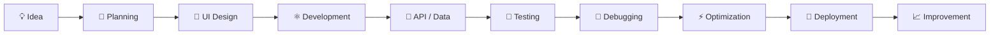

<div align="center">

# 👩‍💻 MALIHA ARSHAD

### 🚀 FRONTEND DEVELOPER


<br>

<a href="https://github.com/maliha12">

</a>

<a href="https://github.com/maliha12?tab=repositories">

</a>


<br><br>


<br><br>

> **"Turning ideas into responsive, interactive and meaningful digital experiences."**

</div>

---

# 🌟 ZYNXIS FRONTEND DEVELOPMENT INTERNSHIP

Welcome to the official GitHub repository of **Maliha Arshad's Zynxis Frontend Development Internship**.

This repository documents an **8-week practical frontend development journey**, progressing from responsive layouts and reusable components to API integration, state management, performance optimization, and a complete final dashboard application.

The goal of this internship was to transform frontend concepts into **real-world development skills** through practical implementation, problem solving, UI development and modern web technologies.

### 🚀 Development Journey

```text
LEARN
  ↓
BUILD
  ↓
INTERACT
  ↓
INTEGRATE
  ↓
MANAGE
  ↓
OPTIMIZE
  ↓
CREATE
  ↓
DEPLOY
```

---

# 👩‍💻 DEVELOPER PROFILE

<table>
<tr>
<td width="50%">

### 👤 Personal Profile

**Name:** Maliha Arshad

**GitHub:** `maliha12`

**Role:** Frontend Developer

**Internship:** Zynxis Frontend Development Internship

**Duration:** 8 Weeks

**Specialization:** Frontend Development

</td>

<td width="50%">

### 💼 Professional Focus

⚛️ React Development
🟨 JavaScript
🔷 TypeScript
🎨 UI/UX Development
📱 Responsive Design
🔌 API Integration
📦 State Management
⚡ Performance Optimization

</td>
</tr>
</table>

---

# 🧠 ABOUT THE DEVELOPER

I am a passionate **Frontend Developer** interested in building modern, responsive and user-friendly web applications.

My focus is on creating interfaces that are not only visually appealing but also:

* 📱 Responsive
* ⚡ Fast
* 🧩 Reusable
* 🎯 User-friendly
* 🛠️ Maintainable
* 🔌 Interactive
* 🚀 Production-oriented

I enjoy converting ideas into functional interfaces and continuously improving my development skills through practical projects.

---

# 💡 DEVELOPER PHILOSOPHY

```javascript
const developer = {
    name: "Maliha Arshad",
    username: "maliha12",
    role: "Frontend Developer",

    mission:
        "Build modern, responsive and user-friendly web experiences.",

    values: [
        "Clean Code",
        "Reusable Components",
        "Responsive Design",
        "Great User Experience",
        "Performance",
        "Continuous Learning"
    ],

    mindset:
        "Learn something new. Build something useful. Improve every day."
};
```

---

# 🛠️ TECHNOLOGY STACK

## 🌐 Core Technologies

<div align="center">


</div>

| Technology | Purpose                |
| ---------- | ---------------------- |
| HTML5      | Semantic web structure |
| CSS3       | Styling and layouts    |
| JavaScript | Dynamic functionality  |
| TypeScript | Type-safe development  |

---

## ⚛️ Frontend Technologies

<div align="center">


</div>

* ⚛️ React
* 🪝 React Hooks
* 🧩 Component Architecture
* 🔄 Dynamic Rendering
* 📦 Reusable Components
* ⚡ Vite
* 🛠️ Modern Frontend Architecture

---

## 🎨 Styling & UI

<div align="center">


</div>

* 🎨 Tailwind CSS
* 📱 Responsive Design
* 📐 Flexbox
* 🔲 CSS Grid
* ✨ Animations
* 🌀 Transitions
* 🧩 UI Components
* 🌙 Dark / Light Interfaces

---

## 🔌 APIs & Data

* REST APIs
* Fetch API
* JSON
* Async/Await
* Dynamic data rendering
* Loading states
* Error handling
* API-driven interfaces

---

## 🔧 Development Tools

<div align="center">


</div>

* Git
* GitHub
* VS Code
* npm
* Browser DevTools
* Debugging Tools

---

# 📚 8-WEEK INTERNSHIP ROADMAP

<div align="center">

| Week | Module                     | Main Focus                         | Status |
| :--: | -------------------------- | ---------------------------------- | :----: |
|  01  | 📱 Responsive Layouts      | Responsive & mobile-first design   |    ✅   |
|  02  | 🧩 Component Library       | Reusable UI architecture           |    ✅   |
|  03  | ⚡ Dynamic Interactions     | Interactive frontend functionality |    ✅   |
|  04  | 🎨 Styling & Animations    | Modern UI & animations             |    ✅   |
|  05  | 🔌 API Integration         | REST APIs & dynamic data           |    ✅   |
|  06  | 📦 State Management        | Application state & data flow      |    ✅   |
|  07  | ⚡ Performance Optimization | Speed & Lighthouse optimization    |    ✅   |
|  08  | 🏆 Final Dashboard         | Complete frontend application      |    ✅   |

</div>

---

# 📱 WEEK 01 — RESPONSIVE LAYOUTS

### 🎯 Objective

Learn how to build interfaces that adapt smoothly to different screen sizes.

### 🔨 Key Concepts

* Mobile-first development
* Responsive layouts
* CSS Flexbox
* CSS Grid
* Media queries
* Responsive navigation
* Fluid layouts
* Cross-device compatibility

### 📱 Target Devices

```text
📱 Mobile
      ↓
📲 Tablet
      ↓
💻 Laptop
      ↓
🖥️ Desktop
      ↓
🖥️ Large Displays
```

### ✅ Status

**COMPLETED**

---

# 🧩 WEEK 02 — COMPONENT LIBRARY

### 🎯 Objective

Build reusable and maintainable UI components.

### 🔨 Key Concepts

* Component architecture
* Reusability
* Component composition
* Buttons
* Cards
* Forms
* Navigation
* UI consistency

### ♻️ Development Principle

```text
Build Once
    ↓
Reuse Everywhere
    ↓
Maintain Easily
```

### ✅ Status

**COMPLETED**

---

# ⚡ WEEK 03 — DYNAMIC INTERACTIONS

### 🎯 Objective

Transform static interfaces into interactive applications.

### 🔨 Key Concepts

* React Hooks
* Event handling
* Dynamic rendering
* Conditional rendering
* User interactions
* State-based interfaces
* Interactive components

### ⚛️ Focus

```text
USER ACTION
     ↓
EVENT
     ↓
STATE UPDATE
     ↓
COMPONENT UPDATE
     ↓
NEW UI
```

### ✅ Status

**COMPLETED**

---

# 🎨 WEEK 04 — STYLING & ANIMATIONS

### 🎯 Objective

Create visually engaging and modern interfaces.

### ✨ Implemented Concepts

* Modern UI styling
* Tailwind CSS
* Hover effects
* Transitions
* Animations
* Responsive styling
* Visual hierarchy
* Interactive elements

### 🎨 Design Philosophy

> **Clean + Modern + Responsive + Interactive**

### ✅ Status

**COMPLETED**

---

# 🔌 WEEK 05 — API INTEGRATION

### 🎯 Objective

Connect frontend applications with external data sources.

### 🔨 Key Concepts

* REST APIs
* Fetch API
* JSON
* Async/Await
* Loading states
* Error handling
* Dynamic rendering
* API-driven interfaces

### 🔄 API FLOW

```text
┌──────────────┐
│   FRONTEND   │
└──────┬───────┘
       │
       ▼
┌──────────────┐
│  API REQUEST │
└──────┬───────┘
       │
       ▼
┌──────────────┐
│    SERVER    │
└──────┬───────┘
       │
       ▼
┌──────────────┐
│ JSON RESPONSE│
└──────┬───────┘
       │
       ▼
┌──────────────┐
│      UI      │
└──────────────┘
```

### ✅ Status

**COMPLETED**

---

# 📦 WEEK 06 — STATE MANAGEMENT

### 🎯 Objective

Understand and manage application data efficiently.

### 🔨 Key Concepts

* Application state
* Component state
* Data flow
* State synchronization
* Persistent data
* Component communication
* Dynamic UI updates

### 🧠 State Flow

```text
USER ACTION
     ↓
STATE CHANGE
     ↓
DATA UPDATE
     ↓
COMPONENT RENDER
     ↓
UPDATED INTERFACE
```

### ✅ Status

**COMPLETED**

---

# ⚡ WEEK 07 — PERFORMANCE OPTIMIZATION

### 🎯 Objective

Build fast, efficient and optimized web applications.

### 🚀 Optimization Techniques

* 💤 Lazy loading
* 🖼️ Image optimization
* 📦 Component optimization
* ⚡ Efficient rendering
* 🧹 Code optimization
* 📱 Mobile performance
* 🔍 Lighthouse auditing
* 📊 Performance analysis

### 🏆 Performance Target

```text
┌────────────────────────────┐
│      LIGHTHOUSE AUDIT      │
├────────────────────────────┤
│                            │
│   ⚡ PERFORMANCE → 90+     │
│   ♿ ACCESSIBILITY → HIGH   │
│   🔍 SEO → HIGH            │
│   ✅ BEST PRACTICES → HIGH │
│                            │
└────────────────────────────┘
```

### ✅ Status

**COMPLETED**

---

# 🏆 WEEK 08 — FINAL PROJECT

# 🚀 ZYNXIS CLIENT DASHBOARD

The final project combines the knowledge and practical experience gained throughout the internship into one complete frontend application.

## 🎯 Project Objective

Build a professional **SaaS-style Client Management Dashboard** with a modern interface, responsive design, interactive functionality and complete CRUD workflows.

---

# ✨ FINAL PROJECT FEATURES

## 📊 Dashboard

* 📈 Dashboard statistics
* 📊 Data visualization
* 📋 Activity information
* 📌 Summary cards
* 🎯 Professional dashboard layout

---

## 👥 Client Management

```text
➕ CREATE
   ↓
👁️ READ
   ↓
✏️ UPDATE
   ↓
🗑️ DELETE
```

Features include:

* Add clients
* View client information
* Edit client information
* Delete clients
* Search clients
* Filter clients
* Dynamic updates

---

## 🎨 User Interface

* 🌙 Dark Mode
* ☀️ Light Mode
* 📱 Fully Responsive
* ✨ Smooth Animations
* 🧩 Reusable Components
* 🔔 Notifications
* 🎨 Modern UI
* 🖱️ Interactive Elements

---

## 📝 Forms

* Form validation
* Input handling
* Error states
* User feedback
* Dynamic forms
* Clean form UX

---

## ⚡ Performance

* Optimized rendering
* Responsive layouts
* Efficient component structure
* Performance-focused implementation
* Mobile-friendly experience

---

# 🏗️ PROJECT ARCHITECTURE

```text
                    🚀 ZYNXIS DASHBOARD
                           │
             ┌─────────────┴─────────────┐
             │                           │
        🎨 UI LAYER                 🧠 LOGIC LAYER
             │                           │
      ┌──────┼──────┐              ┌─────┼─────┐
      │      │      │              │     │     │
   Navbar  Cards  Forms          State  CRUD  Search
      │      │      │              │     │     │
      └──────┼──────┘              └─────┼─────┘
             │                           │
             └─────────────┬─────────────┘
                           │
                     💾 DATA LAYER
                           │
                           ▼
                     📊 DASHBOARD
```

---

# 📂 REPOSITORY STRUCTURE

```text
Zynxis-internship-Maliha-Arshad-
│
├── 📁 Week1_Responsive_layouts
│   └── Responsive Layout Project
│
├── 📁 Week2_Component_library
│   └── Component Library Project
│
├── 📁 Week3_Dynamic_Interactions
│   └── Dynamic Interaction Project
│
├── 📁 Week4_Styling_Animations
│   └── Styling & Animation Project
│
├── 📁 Week5_API_Integration
│   └── API Integration Project
│
├── 📁 Week6_State_Management
│   └── State Management Project
│
├── 📁 Week7_Performance_Optimization
│   └── Performance Optimization Project
│
├── 📁 Week8_final_Dashboard_Project
│   └── 🚀 Zynxis Client Dashboard
│
└── 📄 README.md
```

---

# 💼 FRONTEND DEVELOPER SKILLS

<div align="center">

| 💻 Skill                 | 📊 Proficiency |
| ------------------------ | :------------: |
| HTML5                    |      ⭐⭐⭐⭐⭐     |
| CSS3                     |      ⭐⭐⭐⭐⭐     |
| JavaScript               |      ⭐⭐⭐⭐⭐     |
| TypeScript               |      ⭐⭐⭐⭐      |
| React                    |      ⭐⭐⭐⭐⭐     |
| Responsive Design        |      ⭐⭐⭐⭐⭐     |
| UI/UX                    |      ⭐⭐⭐⭐⭐     |
| API Integration          |      ⭐⭐⭐⭐      |
| State Management         |      ⭐⭐⭐⭐      |
| Git & GitHub             |      ⭐⭐⭐⭐⭐     |
| Performance Optimization |      ⭐⭐⭐⭐      |

</div>

> These ratings represent the technologies and concepts practiced during the internship.

---

# 🧹 DEVELOPMENT PRINCIPLES

### 🧩 01 — REUSABILITY

Create components once and reuse them wherever possible.

### 📱 02 — RESPONSIVENESS

Every interface should provide a smooth experience across devices.

### 🎨 03 — USER EXPERIENCE

Design interfaces around clarity, accessibility and ease of use.

### ⚡ 04 — PERFORMANCE

Optimize applications for speed and efficient rendering.

### 🧹 05 — CLEAN CODE

Write organized, readable and maintainable code.

### 🔄 06 — CONTINUOUS IMPROVEMENT

Build → Test → Learn → Improve.

---

# 🔄 DEVELOPMENT WORKFLOW



---

# 🧠 SKILLS DEVELOPED DURING THE INTERNSHIP

```text
📱 Responsive Development
        │
        ▼
🧩 Component Architecture
        │
        ▼
⚛️ React Development
        │
        ▼
⚡ Dynamic Interactions
        │
        ▼
🎨 UI/UX & Animations
        │
        ▼
🔌 API Integration
        │
        ▼
📦 State Management
        │
        ▼
⚡ Performance Optimization
        │
        ▼
🔧 Git & GitHub
        │
        ▼
🏆 Complete Frontend Project
```

---

# 📈 INTERNSHIP PROGRESS

<div align="center">

```text
WEEK 01  ████████████████████  100%
WEEK 02  ████████████████████  100%
WEEK 03  ████████████████████  100%
WEEK 04  ████████████████████  100%
WEEK 05  ████████████████████  100%
WEEK 06  ████████████████████  100%
WEEK 07  ████████████████████  100%
WEEK 08  ████████████████████  100%

         🏆 INTERNSHIP COMPLETED
```

</div>

---

# 🔗 GITHUB PROFILE

<div align="center">

<a href="https://github.com/maliha12">


</a>

<br><br>

<a href="https://github.com/maliha12?tab=repositories">


</a>

</div>

---

# 📊 GITHUB ACTIVITY

<div align="center">

### 👩‍💻 MALIHA ARSHAD


<br>

**Explore the complete development journey on GitHub.**

</div>

---

# 🎯 PROFESSIONAL OBJECTIVE

> **To become a highly skilled frontend developer capable of designing and developing modern, responsive, accessible and high-performance web applications while continuously learning and adapting to new technologies.**

---

# 🌱 CONTINUOUS LEARNING

The learning journey does not stop after the internship.

### Future Development Areas

```text
⚛️ Advanced React
        ↓
🔷 Advanced TypeScript
        ↓
🏗️ Scalable Frontend Architecture
        ↓
🧪 Testing
        ↓
♿ Accessibility
        ↓
⚡ Advanced Performance
        ↓
🔐 Web Security
        ↓
🚀 Production Applications
```

---

# 🏅 INTERNSHIP ACHIEVEMENT

<div align="center">

## 🏆 8 WEEKS • 8 MODULES • 1 COMPLETE JOURNEY

```text
┌──────────────────────────────────────────────┐
│                                              │
│             🚀 ZYNXIS INTERNSHIP             │
│                                              │
│             👩‍💻 MALIHA ARSHAD               │
│                                              │
│             FRONTEND DEVELOPER               │
│                                              │
│             8 / 8 WEEKS COMPLETED            │
│                                              │
│             🧩 COMPONENTS                    │
│             ⚡ INTERACTIONS                   │
│             🎨 UI & ANIMATIONS               │
│             🔌 API INTEGRATION               │
│             📦 STATE MANAGEMENT              │
│             ⚡ PERFORMANCE                   │
│             🏆 FINAL DASHBOARD               │
│                                              │
│             ✅ INTERNSHIP COMPLETE           │
│                                              │
└──────────────────────────────────────────────┘
```

</div>

---

# 💙 THANK YOU — ZYNXIS

A special thanks to **Zynxis** for providing the opportunity to learn, practice and develop frontend skills through a structured 8-week internship.

This repository represents the complete journey from individual frontend concepts to the development of a complete dashboard application.

---

# 🚀 FINAL MESSAGE

<div align="center">


<br><br>

### 👩‍💻 MALIHA ARSHAD

**Frontend Developer**

⚛️ React • 🟨 JavaScript • 🔷 TypeScript • 🎨 UI/UX • 📱 Responsive Web

<br>

### ⭐ BUILD • LEARN • CREATE • GROW ⭐

<br>

<a href="https://github.com/maliha12">

</a>

<br><br>

**Thank you for visiting this repository! ❤️**

</div>
